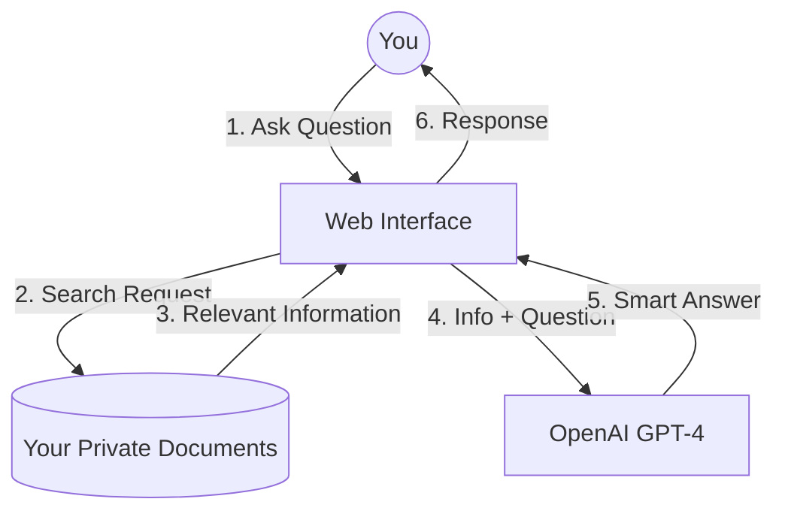

<div align="center">
  <h1>GenAI RAG Platform</h1>
  <p>An Enterprise-Grade, Serverless Generative AI Platform powered by AWS and OpenAI.</p>
</div>

---

## 🎯 What is this?
The **GenAI RAG Platform** is a production-ready application that allows you to "chat" with your own documents. It uses a technique called **RAG (Retrieval-Augmented Generation)** to combine the deep, searchable knowledge of your private files with the conversational intelligence of advanced AI models like OpenAI's GPT-4.

This project is built using professional, enterprise-grade architecture. It is scalable, highly secure, and entirely automated, meaning you can deploy a customized AI assistant for your organization without needing to manage servers.

---

## 🏗️ How it Works (Architecture)
When you ask a question, the platform performs a few invisible steps:
1. **Search:** It securely searches through the documents you've uploaded (stored in AWS).
2. **Contextualize:** It extracts the most relevant paragraphs from those documents.
3. **Generate:** It sends your question, along with those relevant paragraphs, to a large language model (like GPT-4).
4. **Answer:** The AI reads your document excerpts and provides a precise, factual answer based *only* on your data.



---

## 🚀 Easy Deployment Guide (For Non-Technical Users)
We have fully automated the deployment process using **Infrastructure as Code** and **GitHub Actions**. You don't need to write a single line of code to get this running in the cloud.

Follow these steps exactly to deploy your own private AI platform.

### Step 1: Prerequisites
Before you begin, you need accounts on three platforms:
1. **GitHub Account:** To host the code and run the automation. (Free)
2. **AWS Account:** Amazon Web Services, where the application will live. (Pay-as-you-go)
3. **OpenAI Account:** To access the GPT-4 brain. You will need an API Key. (Pay-as-you-go)

### Step 2: Fork this Repository
1. In the top right corner of this GitHub page, click the **"Fork"** button.
2. Select your personal GitHub account to create a copy of this repository that you control.

### Step 3: Get your OpenAI API Key
1. Go to [platform.openai.com](https://platform.openai.com/api-keys).
2. Click **"Create new secret key"**.
3. Name it "RAG Platform" and copy the long string of letters and numbers. **Save this somewhere safe; you won't see it again.**

### Step 4: Configure AWS Credentials
To allow GitHub to build things in your AWS account automatically, you need to create an access key.
1. Log into your **AWS Management Console**.
2. Search for **IAM** (Identity and Access Management) in the top search bar.
3. On the left side, click **Users**, then click **Add users**.
4. Name the user `github-deployer` and click Next.
5. Select **"Attach policies directly"** and check the box next to `AdministratorAccess`. *(Note: For production, a more restrictive policy is recommended, but this is easiest for setup).* Click Next, then Create User.
6. Click on your newly created `github-deployer` user.
7. Go to the **Security credentials** tab.
8. Scroll down to **Access keys** and click **Create access key**.
9. Select **Command Line Interface (CLI)**, check the box, and click Next.
10. Click **Create access key**.
11. **IMPORTANT:** Keep this tab open or copy the `Access key ID` and `Secret access key`. You need them for the next step.

### Step 5: Connect Everything in GitHub
Now, tell your GitHub repository the secret keys so it can build the platform for you.
1. Go to your **Forked Repository** on GitHub.
2. Click the **Settings** tab.
3. On the left sidebar, click **Secrets and variables**, then click **Actions**.
4. You are going to click **"New repository secret"** three times to add the following:
   * **Name:** `AWS_ACCESS_KEY_ID` | **Secret:** (Paste the Access Key ID from Step 4)
   * **Name:** `AWS_SECRET_ACCESS_KEY` | **Secret:** (Paste the Secret Access Key from Step 4)
   * **Name:** `OPENAI_API_KEY` | **Secret:** (Paste the OpenAI key from Step 3)

### Step 6: Trigger the Magic (Deployment)!
You are ready to deploy.
1. In your GitHub repository, click the **Actions** tab at the top.
2. On the left, click **CD Pipeline** (Continuous Deployment).
3. On the right side, there is a gray bar that says "This workflow has a workflow_dispatch event trigger." Click the **Run workflow** dropdown button there.
4. Leave the branch as `main` and click the green **Run workflow** button.

**That's it!** Grab a coffee. The automation will now log into AWS, build the infrastructure, package the application, and turn it on. This usually takes about 10-15 minutes.

### Step 7: Use your Platform
1. Log into your **AWS Management Console**.
2. Search for **App Runner** in the top search bar.
3. You will see a service named `genai-rag-platform-service`. Click on it.
4. Look for the **"Default domain"** (it will look like a random URL ending in `.awsapprunner.com`).
5. Click that link to open your new AI Assistant!

---

## 📚 Uploading Your Documents
To make the AI smart about your specific data, you need to upload your files to AWS:
1. In the AWS Console, search for **S3**.
2. Find the bucket named `genai-rag-dev-docs-[your-account-number]`.
3. Click into that bucket and click **Upload**.
4. Upload your PDFs, Word documents, text files, etc.
5. In the AWS Console, search for **Bedrock**.
6. On the left sidebar, click **Knowledge bases**.
7. Click your configured Knowledge Base (`genai-rag-dev-kb`), then configure it to sync your S3 bucket. Click **"Sync"** to process your newly uploaded files.

---

## 🛠️ For Developers & Engineers
If you want to modify the code, run it locally, or understand the technical implementation, please read our dedicated developer documentation:

* [🏗️ **Architecture Overview**](docs/architecture.md)
* [⚙️ **RAG Pipeline Deep Dive**](docs/rag_pipeline.md)
* [🔐 **Security Architecture**](docs/security.md)
* [📈 **Scaling & Operations**](docs/scaling.md)
* [🚀 **Detailed Deployment Guide**](docs/deployment.md)

### Running Locally (Quickstart)
```bash
# 1. Clone the repository
git clone https://github.com/your-username/genai-rag-platform.git
cd genai-rag-platform

# 2. Setup your .env file
cp .env.example .env
# Fill in your AWS and OpenAI details in the .env file

# 3. Install dependencies
make setup

# 4. Run the API and UI (in separate terminals)
make dev-api
make dev-ui
```
